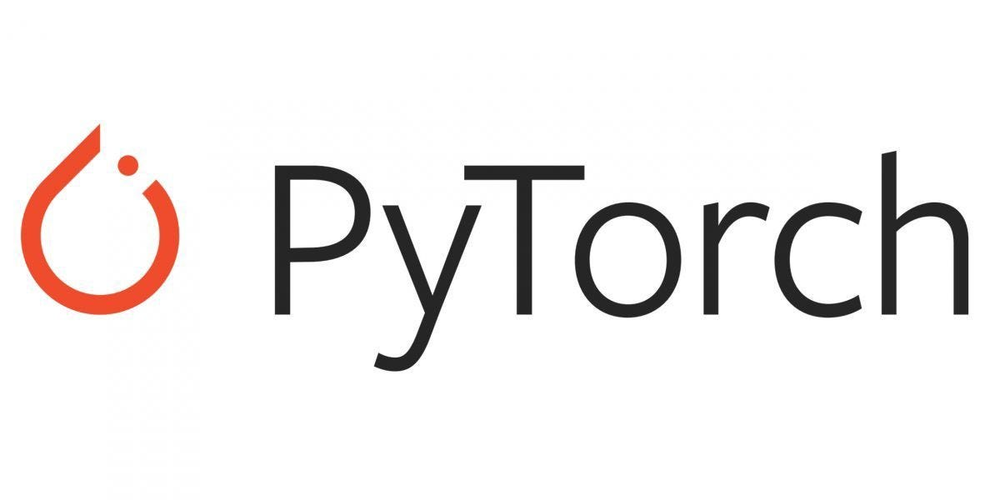

# M3 Segmentation Model

An early version of our M3 Segmentation Model using U-Net Architecture. This repository contains the code for training and applying the segmentation model to images.

<h3>Description</h3>

This project implements a segmentation model based on the U-Net architecture using PyTorch. The U-Net model is trained on a dataset to perform image segmentation, specifically for segmenting objects in medical images. The model has been designed to accurately delineate and identify specific structures in the images.

<h3>Features</h3>
<ul>
  <li>U-Net architecture for image segmentation</li>
  <li>Training code with customizable hyperparameters</li>
  <li>Inference code to apply segmentation to new images</li>
  <li>Pre-trained checkpoint for quick start</li>
</ul>
<h3>Pre-installation</h3>

Pytorch was not included in the requirements.txt. I recommend to create a conda virtual environment first and install Pytorch based on the generated pip command from its own documentation.

<h3>Pytorch Documentation</h3>

<a href="https://pytorch.org/get-started/locally/">https://pytorch.org/get-started/locally/</a>

You can also refer to this. However, it might get deprecated if changes in the documentation will be applied. Use the link documentation instead if these installation commands won't work. Only choose one

<h3>Using GPU - Only use if you have NVIDIA Graphics Card that supports CUDA.</h3>

<code>pip3 install torch torchvision torchaudio --index-url https://download.pytorch.org/whl/cu118</code>

<h3>Using CPU</h3>

<code>pip3 install torch torchvision torchaudio</code>

<h3>Download Model here:</h3>

<a href="https://wvsueduph-my.sharepoint.com/:u:/g/personal/russel_yasol_wvsu_edu_ph/Efgjv6YteO5HuQubdhCAvgoBVUHpLwutoo8M5qN-0GcMBw?e=6Sf9Jd">https://wvsueduph-my.sharepoint.com/:u:/g/personal/russel_yasol_wvsu_edu_ph/Efgjv6YteO5HuQubdhCAvgoBVUHpLwutoo8M5qN-0GcMBw?e=6Sf9Jd</a>

Copy and paste inside the M3Segmentation folder.

<h2>Installation</h2>
<ol>
  <li>Clone the repository:</li>
  <pre>
    <code>git clone https://github.com/dr-dolomite/M3Segmentation.git</code>
  </pre>
  <li>Change into the project directory:</li>
  <pre>
    <code>cd m3-segmentation-model</code>
  </pre>
  <li>Create / Activate your virtual environment:</li>
  <pre>
    <code>conda create -n M3segment python=3.10 -y</code>
    <code>conda activate M3segment</code>
  </pre>
  <li>Install the required packages:</li>
  <pre>
    <code>pip install -r requirements.txt</code>
  </pre>
  <li>Perform train or test.</li>
</ol>
